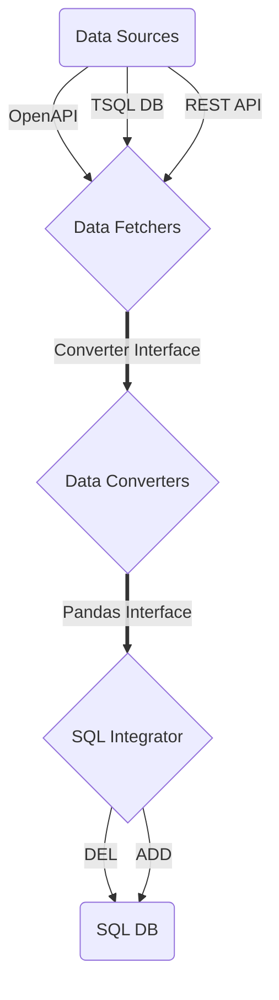

# pydie: Python Database Integration Engine

Framework to integrate data from various sources into SQL databases using opinionated, standarized interfaces.

Built to work with Apache Airflow.

## Overall architecture

## Testing and Examples

The `tests` directory contains tests for the library. Such tests may also serve as implementation examples.

## Fetchers

Fetchers perform data intake funcionality.
They are custom coded to fetch from different data sources.

They do have a unified in/out interface so that they may better fit into a unified data integration system.

## Converters

Converters take from Receivers using an interface.
They then convert the data into the Integrator interface.

## Integrator

Integrates data into a SQL database.
